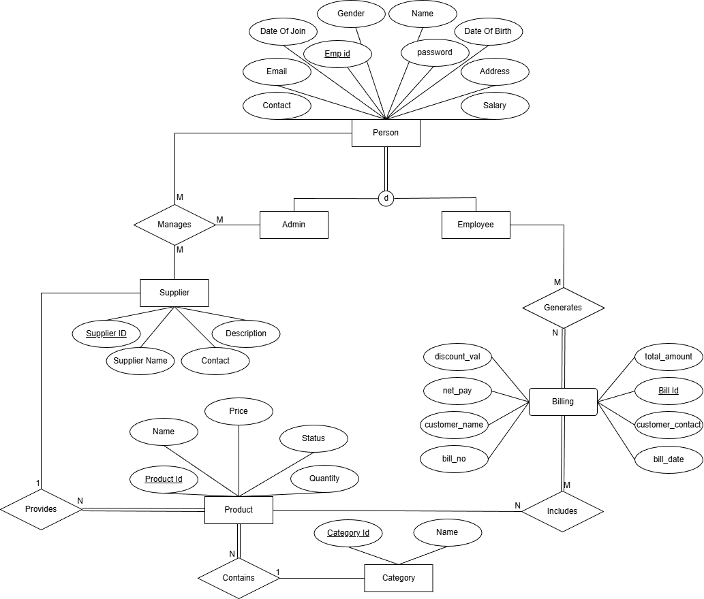
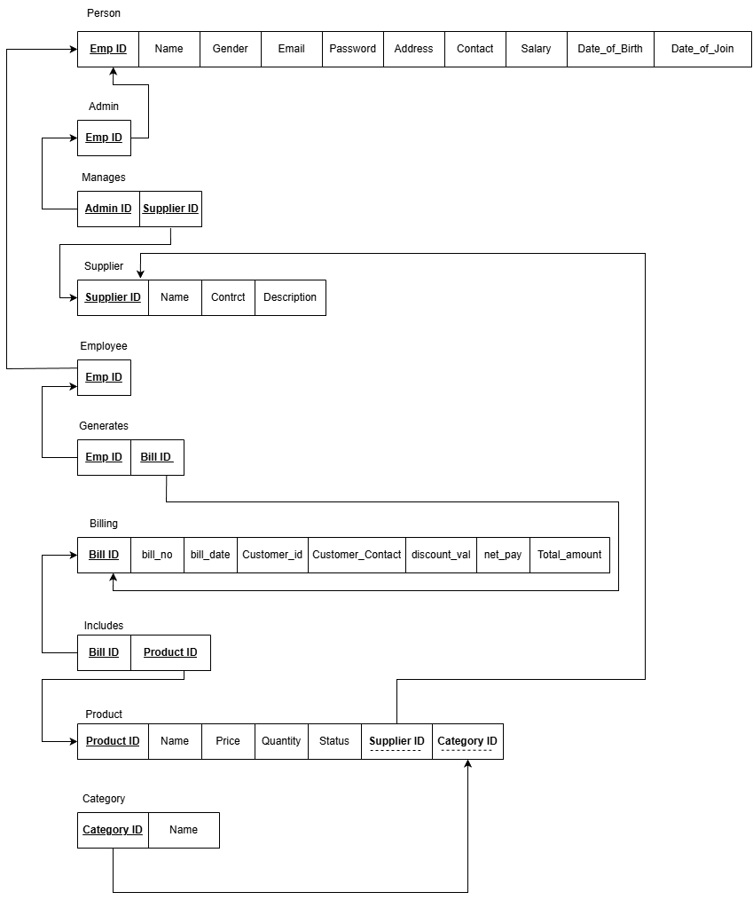
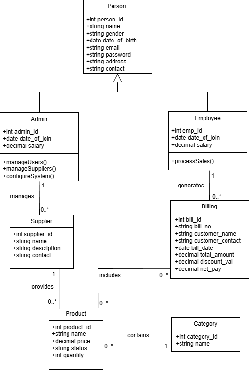
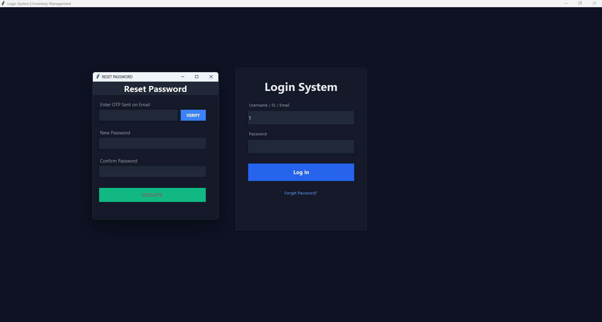
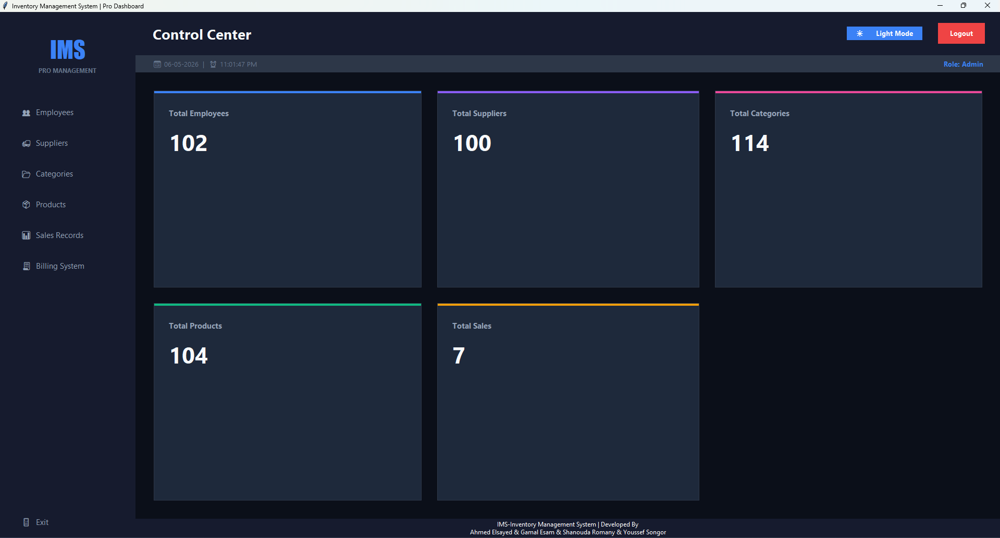
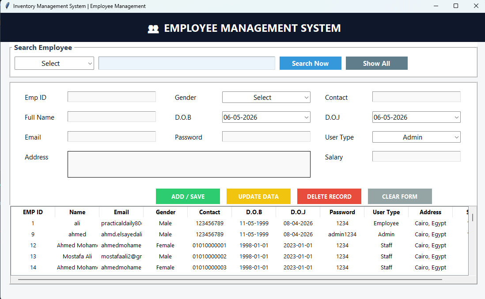
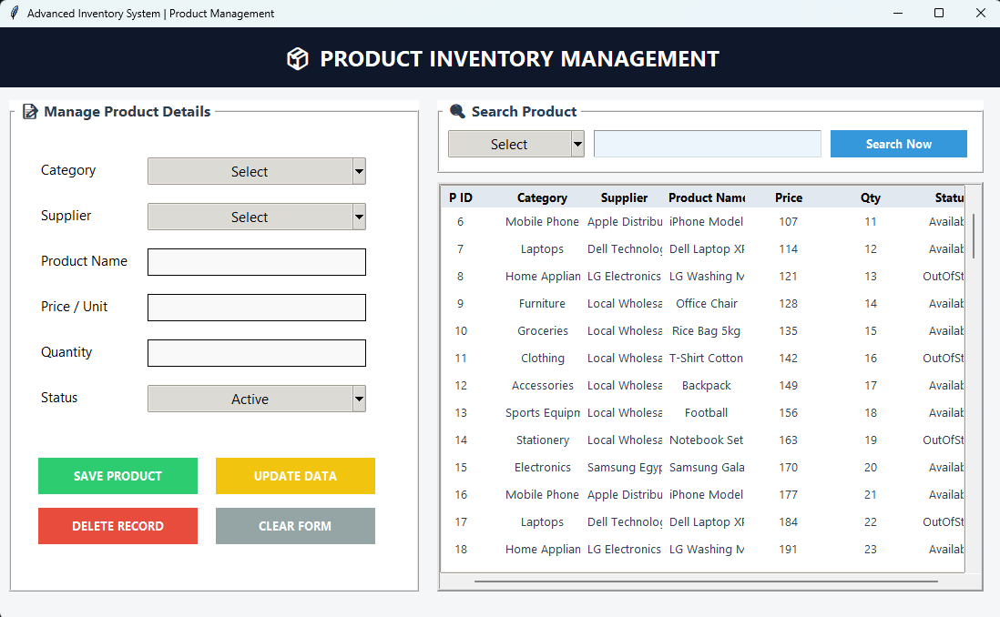
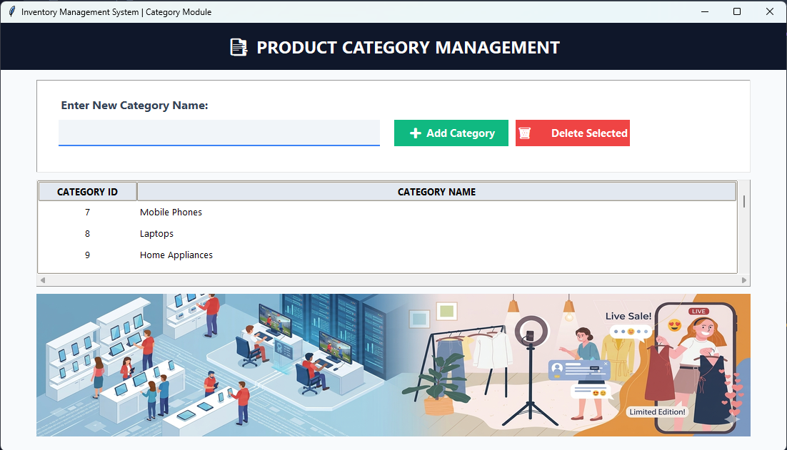
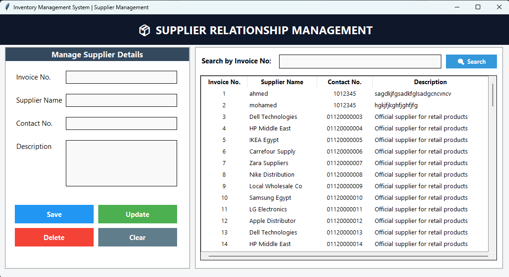
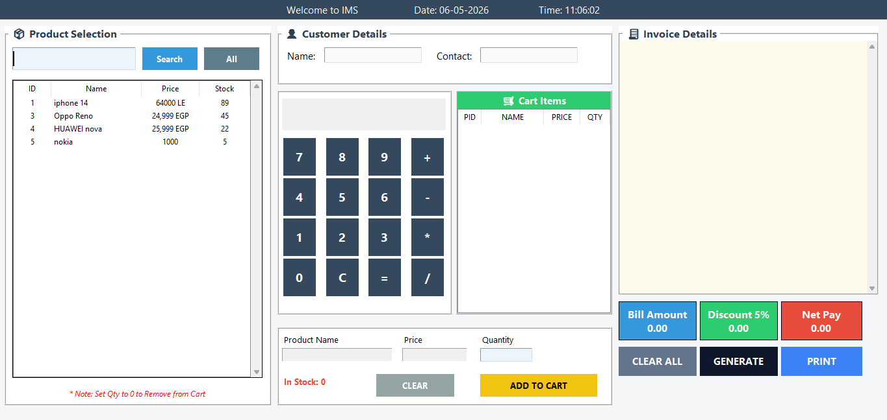

# 🧾 Inventory Management System (IMS)

## 📌 Project Overview

The **Inventory Management System (IMS)** is a desktop-based application developed using **Python (Tkinter)** and **Microsoft SQL Server**.

The system is designed to simplify and automate inventory operations including:

* Employee management
* Product tracking
* Supplier handling
* Billing and sales

This project was developed as part of a university assignment, but it reflects a real-world business scenario where efficient data handling and user interaction are essential.

---

## 🎯 Objectives

The main goals of this system are:

* Provide a **secure authentication system**
* Manage employees with different roles (Admin / Staff)
* Organize products and categories efficiently
* Maintain supplier records
* Generate and store billing invoices
* Connect GUI with a real database system

---

## 🧠 System Design

### 📊 EER Diagram



This diagram represents the **Enhanced Entity Relationship Design** of the system, showing:

* Entities (Employee, Product, Supplier, Category, Billing)
* Relationships between them
* Primary and Foreign Keys

It helped in structuring the database before implementation.

---

### 🗂️ Database Schema



The schema defines:

* Tables structure
* Attributes and data types
* Relationships between tables

---

### 📐 UML Diagram



The UML diagram describes:

* System structure
* Classes and their interactions
* Data flow between modules

---

### 🎭 Use Case Diagram


This diagram explains:

* System actors (Admin / Employee)
* Actions like:

  * Login
  * Manage Products
  * Generate Bills
  * Manage Suppliers

---

## 🧱 Database Structure

### 👥 Employee Table

| Attribute | Description          |
| --------- | -------------------- |
| eid       | Primary Key          |
| name      | Employee Name        |
| email     | Employee Email       |
| password  | Employee Password    |
| user_type | Role (Admin / Staff) |

---

### 📦 Product Table

| Attribute | Description        |
| --------- | ------------------ |
| pid       | Primary Key        |
| name      | Product Name       |
| category  | Product Category   |
| supplier  | Supplier Name      |
| price     | Product Price      |
| quantity  | Available Quantity |

---

### 🚚 Supplier Table

| Attribute   | Description      |
| ----------- | ---------------- |
| invoice     | Primary Key      |
| name        | Supplier Name    |
| contact     | Supplier Contact |
| description | Additional Info  |

---

### 🗂️ Category Table

| Attribute | Description   |
| --------- | ------------- |
| cid       | Primary Key   |
| name      | Category Name |

---

### 🧾 Billing Table

| Attribute        | Description   |
| ---------------- | ------------- |
| bill_id          | Primary Key   |
| bill_no          | Bill Number   |
| bill_date        | Date          |
| customer_name    | Customer Name |
| customer_contact | Contact       |
| total_amount     | Total         |
| discount         | Discount      |
| net_pay          | Final Payment |

---

## 🚀 Features

* 🔐 Secure Login System
* 🔁 Password Recovery using OTP via Email
* 📊 Dashboard with statistics
* 👥 Employee Management
* 📦 Product Management
* 🚚 Supplier Management
* 🧾 Billing System
* 📁 Saving invoices as text files

---

### 🔑 Login Screen



This screen allows users to log in using:

* Email / ID  
* Password  

📧 Email input field with validation:


---

### 📊 Dashboard



Displays:

* Total Employees
* Products
* Suppliers
* Sales

---

### 👥 Employee Management



Allows:

* Add / Update / Delete
* Search employees

---

### 📦 Product Management



Manage:

* Product name
* Category
* Supplier
* Price & Quantity

---

### 🗂️ Category Module


---
### 🚚 Supplier Management



Stores:

* Supplier details
* Contact info
* Notes

---

### 🧾 Billing System



Used for:

* Creating invoices
* Calculating totals
* Applying discounts

---

## 🛠️ Technologies Used

* Python (Tkinter) → GUI
* SQL Server → Database
* pyodbc → Database Connection
* smtplib → Email OTP
* File System → Store Bills

---

## ⚙️ How to Run

1. Install SQL Server
2. Create database (ims)
3. Run:

```bash
python login.py
```

---

## ⚠️ Challenges

* Connecting Python with SQL Server
* Handling OTP email security
* Designing UI using Tkinter
* Managing multiple modules

---

## 🔮 Future Improvements

* Convert to Web App 🌐
* Add PDF invoices 📄
* Improve security (Password Hashing) 🔐
* Add analytics & reports 📊

---

## 👨‍💻 Team Members

* Ahmed Elsayed
* Gamal Esam
* Shanouda Romany
* Youssef Songor

---

## 💡 Final Note

This project helped us gain hands-on experience in:

* Database Design
* GUI Development
* System Integration
* Problem Solving
